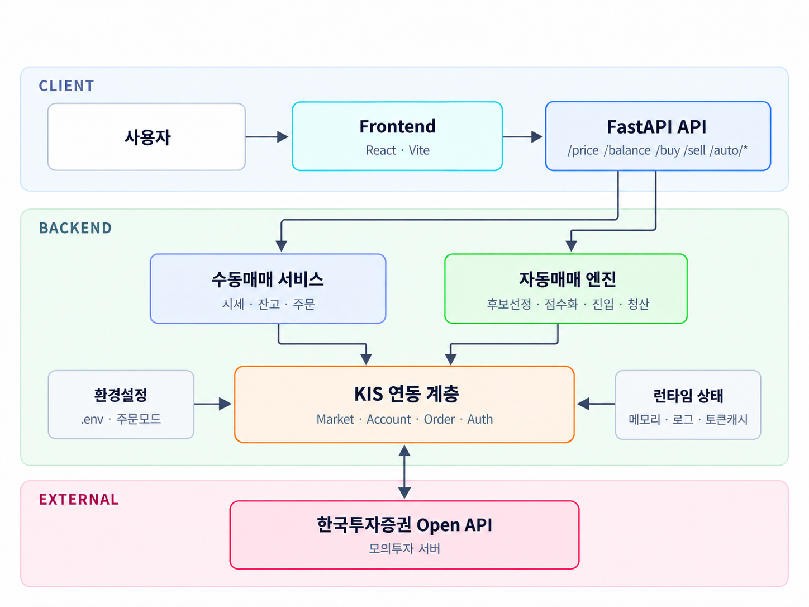
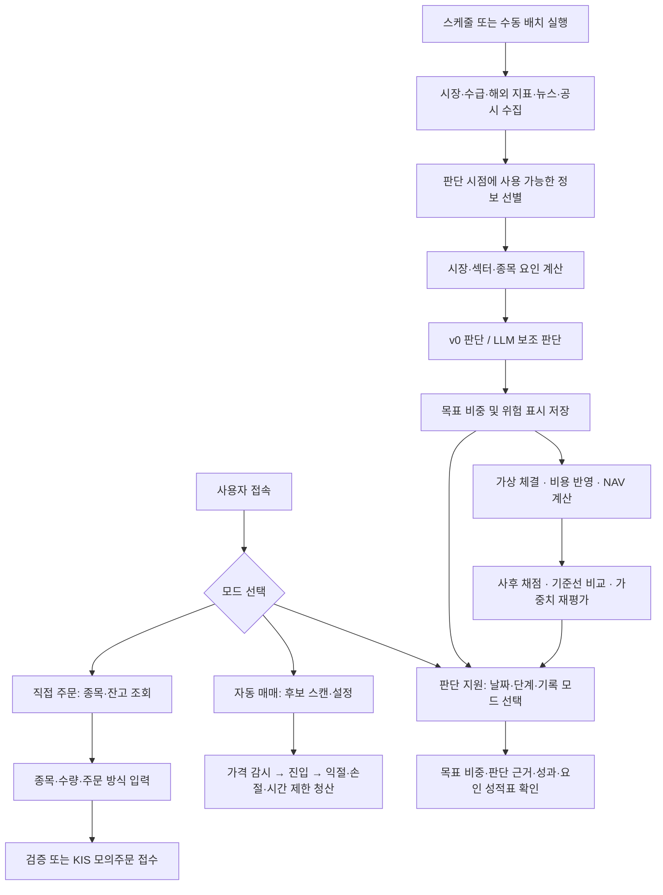

# NA Trader — AI 기반 주식 투자 판단 지원 시스템

NA Trader는 국내 주식 데이터를 수집하고 **시장 → 섹터 → 종목** 순서로 분석하여 목표 투자 비중과 판단 근거를 제공하는 프로젝트입니다. 규칙 기반 분석과 Gemini의 뉴스·공시 해석을 비교하고, 판단 결과를 가상 포트폴리오와 사후 평가로 검증합니다.

사용자 화면은 **직접 주문 / 자동 매매 / 판단 지원**의 세 가지 모드로 구성됩니다. 

## 1. 프로젝트 배경

### 1.1. 국내외 시장 현황 및 문제점

국내에서는 모바일 환경에서 시세 확인과 주문, 투자 정보 조회를 함께 제공하는 서비스가 운영되고 있습니다. 예를 들어 카카오페이증권은 MTS, 투자소식, 주식 모으기와 시세 감지 주문을 제공합니다. 해외에서는 Wealthfront와 같은 서비스가 포트폴리오에 대한 자동 투자, 리밸런싱, 배당 재투자를 제공하고 있습니다.

기업 공시도 금융감독원 OpenDART의 API를 통해 프로그램에서 활용할 수 있습니다. 투자 판단에 활용할 수 있는 데이터가 주가뿐 아니라 공시 등으로 다양해진 만큼, 서로 다른 데이터를 같은 기준 시점으로 정리하는 과정이 필요합니다.

이러한 서비스와 데이터 환경을 바탕으로 본 프로젝트는 다음을 해결할 문제로 설정했습니다. 아래 항목은 프로젝트의 문제 정의이며, 모든 기존 서비스에 해당 기능이 없다는 의미는 아닙니다.

- **정보 통합의 어려움:** 시세, 수급, 해외 시장, 뉴스, 공시의 형식과 갱신 시점이 달라 종합적인 판단에 준비 작업이 필요합니다.
- **판단 근거의 추적:** 추천 결과만으로는 어떤 요인이 종목 선택과 투자 비중에 영향을 주었는지 확인하기 어렵습니다.
- **AI 기여도의 검증:** AI를 사용한 결과가 규칙만 사용한 결과보다 유용한지 비교할 수 있는 기록과 평가 절차가 필요합니다.
- **실험의 재현성:** 과거 시점에 알 수 없었던 정보가 섞이거나 거래 비용을 제외하면 결과를 실제보다 좋게 해석할 수 있습니다.

### 1.2. 필요성과 기대효과

본 프로젝트는 투자 판단의 입력 데이터, 계산 과정, AI 조정 근거와 결과를 한 흐름으로 기록하는 시스템을 구축하고자 합니다. 사용자는 특정 종목의 점수뿐 아니라 시장 상황에 따라 전체 투자 비중이 어떻게 달라지는지도 확인할 수 있습니다.

| 필요성 | 구현 방향 | 기대효과 |
|---|---|---|
| 여러 출처의 데이터를 함께 해석 | 수집 데이터를 SQLite에 저장하고 기준 시각에 맞춰 분석 | 반복적인 자료 정리 부담 감소 |
| 판단 이유를 설명 | 계층별 점수, 요인별 값, 뉴스·공시 근거 표시 | 사용자의 판단 과정 이해와 검토 지원 |
| AI의 영향을 구분 | 코드 요인만 사용하는 버전과 LLM 조정 결과 비교 | AI 활용 효과를 검증할 기반 확보 |
| 안전하게 기능을 학습·실험 | 가상 포트폴리오, 주문 검증, KIS 모의투자 활용 | 실제 자금 투입 없이 동작 확인 |
| 개선 과정을 재현 | 설정 해시, 판단 원장, 재현 실행과 가중치 재평가 | 변경 전후 결과의 비교와 추적 |


## 2. 개발 목표

### 2.1. 목표 및 세부 내용

**데이터 수집부터 판단 근거 제시, 가상 체결, 사후 평가까지 연결되는 투자 판단 지원 시스템을 구현하는 것**이 전체 목표입니다.

| 구분 | 목표 및 세부 내용 | 현재 구현 범위 |
|---|---|---|
| 직접 주문 | 종목 조회, 계좌 잔고 확인, 시장가·지정가 매수·매도 | KIS API 연동, 주문 검증 및 모의주문 |
| 자동 매매 | 후보 종목 선정 후 조건에 따라 진입·청산 | 거래대금 기반 스캔, 가격 모멘텀 진입, 익절·손절·보유시간 제한 프로토타입 |
| 판단 지원 | 코스피200 종목과 선별 ETF의 목표 비중 산출 | 시장·섹터·종목 분석, 핵심 ETF·섹터 ETF·개별 종목·현금 대용 ETF 배분 |
| AI 해석 | 비정형 뉴스·공시의 의미를 판단에 보조적으로 반영 | Gemini 분류·해석, 점수 조정 상한, 실패 시 기권 |
| 결과 설명 | 판단의 원인과 변화 확인 | 자산 상세, 위험 표시, v0(코드 요인만 사용하는 버전)/LLM 및 예비/최종 비교 |
| 검증·개선 | 비용을 반영한 결과와 기준선 비교 | 가상 체결, 자산가치, 요인 성적표, 과거 재현, 가중치 재평가 |


### 2.2. 기존 서비스 대비 차별성

공식 소개에서 확인한 대표 기능과 본 프로젝트의 구현 목적을 비교했습니다. 이 비교는 기능과 설계 목적의 차이를 설명하며, 성능 우위를 의미하지 않습니다.

| 비교 대상 | 공식 안내의 대표 기능 | 본 프로젝트에서 중점을 둔 부분 |
|---|---|---|
| [카카오페이증권](https://www.kakaopaysec.com/) | MTS, 투자 정보, 적립식 투자, 시세 감지 주문 | 주문 기능과 함께 요인별 판단 근거 및 변경 내역을 검토하는 연구·학습 환경 |
| [Wealthfront](https://support.wealthfront.com/hc/en-us/articles/4406593470484-Expert-built-portfolios) | 포트폴리오 자동 투자·리밸런싱·배당 재투자 | 국내 주식·ETF를 대상으로 규칙과 LLM의 기여를 분리하여 실험 |

구체적인 설계 특징은 다음과 같습니다.

1. **계층별 판단:** 시장 점수로 위험자산 비중을 정하고, 섹터·종목 점수로 편입 대상을 선정합니다.
2. **제한된 AI 조정:** LLM의 종합 점수 조정은 기본 설정에서 ±0.2로 제한하며, 호출 실패나 근거 부족 시 기권합니다.
3. **동일 조건 비교:** LLM 유무, 예비·최종 판단 및 기준선 포트폴리오를 비교합니다.
4. **근거 추적:** 뉴스·공시 제목과 시각, 채택·기각 요인, 조정 전후 점수를 제공합니다.
5. **기록 기반 개선:** 판단 당시 설정 해시와 판단 기록의 해시 사슬을 저장하고, 다른 가중치를 사후 적용해 비교합니다. 해시 사슬은 기록의 연결·변경 여부를 점검하는 수단이며 외부 시점 인증을 대신하지는 않습니다.

### 2.3. 사회적 가치 도입 계획

| 가치 | 현재 반영 사항 | 향후 도입·개선 계획 |
|---|---|---|
| 금융 정보 이해도 향상 | 점수 분해, 근거 표시, 카드별 설명 문서 | 비전문가 대상 사용성 평가와 용어 설명 보강 |
| 책임 있는 AI 활용 | 조정 상한, 기권 처리, 위험 표시, 코드 결과와 비교 | 뉴스 분류와 점수 조정의 해석 일관성 점검 |
| 안전한 학습 환경 | 가상 포트폴리오, 실전 주문 차단 | 데이터 결측·오류 상황에 대한 시연 사례 확대 |
| 연구의 투명성 | 판단·설정 기록, 비용 반영 평가, 실험 결과와 한계 문서화 | 하락장을 포함한 장기간 재현과 표본 확대 |
| 지속 가능한 운영 | LLM 일일 예산·호출 상한과 정해진 일정의 배치 처리 | 호출량·운영 비용 측정 및 중복 수집 감소 |


## 3. 시스템 설계

### 3.1. 시스템 구성도



사용자는 React·Vite 화면에서 FastAPI를 통해 시세·잔고·주문과 자동매매를 제어합니다. 수동매매 서비스와 자동매매 엔진은 공통 KIS 연동 계층을 사용하여 한국투자증권 모의투자 서버에 접근합니다. 그림의 CLIENT/BACKEND 구획은 기능 흐름을 표현하며, **FastAPI는 서버에서 실행되는 백엔드 구성요소**입니다.


### 3.2. 사용 기술

| 영역 | 기술 | 사용 목적 |
|---|---|---|
| 프론트엔드 | React 19, JavaScript, CSS | 모드 전환, 입력 폼, 판단 리포트와 성과 시각화 |
| 개발·빌드 | Vite 8, npm, ESLint | 개발 서버, 배포 파일 생성, 정적 검사 |
| 백엔드 | Python, FastAPI, Uvicorn, Pydantic | REST API, 입력 검증, 서비스 실행 |
| 데이터 저장 | SQLite, JSONL | 수집·판단·가상 체결·평가 결과 및 판단 원장 |
| 분석 | pandas, NumPy | 시계열 정리, 요인 계산과 평가 |
| 시장 데이터 | pykrx, FinanceDataReader, yfinance | 국내 시세·수급·ETF 구성 및 해외 지수·환율 수집 |
| 증권사 연동 | 한국투자증권 KIS Open API, LS증권 OpenAPI | 시세·잔고·모의주문 및 실시간 뉴스 |
| 공시 | 금융감독원 OpenDART API | 공시 목록·본문과 정기보고서 재무 데이터 |
| AI | Gemini API | 뉴스 위험 분류, 공시 해석, 점수 조정 |
| 통신·설정 | requests, aiohttp, websockets, PyYAML, python-dotenv | 외부 통신, WebSocket, 설정·환경 변수 관리 |
| 검증 | Python unittest, Git | 단위·통합 테스트 및 코드·설정·기록 변경 관리 |

Python 의존성은 `backend/requirements.lock.txt`, 프론트엔드 의존성은 `frontend/package-lock.json`에 고정되어 있습니다.

## 4. 개발 결과

### 4.1. 전체 시스템 흐름도



판단 지원의 기본 일정은 한국 시간 기준 다음과 같습니다. 일정 실행에는 `ADVISOR_SCHEDULER=1` 설정과 실행 중인 백엔드가 필요합니다.

| 시각 | 처리 내용 |
|---|---|
| 07:30~18:10 | 거래일의 DART 공시 목록을 10분 간격으로 조회 |
| 18:30 | 당일 확정 데이터를 이용한 예비 판단 |
| 07:40 | 밤사이 해외 시장 정보를 반영한 최종 판단 |
| 08:50 | 최종 판단이 없으면 전날 예비 판단을 체결용으로 승격 |

주말·설정된 휴장일에는 판단을 건너뜁니다. 휴장일과 데이터 이용 가능 시각은 설정 및 달력 로직에서 관리합니다.

### 4.2. 기능 설명 및 주요 기능 명세서

| 기능 | 입력 | 출력 | 주요 처리 및 관련 API |
|---|---|---|---|
| 종목·계좌 조회 | 종목코드, KIS 계좌 설정 | 현재가, 현금, 평가금액, 보유 종목 | `GET /price/{stock_code}`, `GET /balance` |
| 직접 주문 | 종목코드, 수량, 매수·매도, 시장가·지정가, 가격 | 검증 결과 또는 주문 접수 결과·주문번호 | `POST /buy`, `POST /sell`; 주문 접수와 체결 완료는 구분 |
| 자동매매 후보 선정 | 선택적인 종목 목록 | 후보 목록 및 선정 결과 | `POST /auto/scan`; 거래대금 등 조건에 따라 스캔 |
| 자동매매 실행·중지 | 수량, 익절·손절률, 최대 보유시간·진입 횟수 등 | 실행 상태, 거래·보유 현황 | `POST /auto/start`, `POST /auto/stop`, `GET /auto/status` |
| 데이터 수집 | 외부 API 키, 기준 시각, 수집 설정 | 시세·수급·뉴스·공시·재무 데이터 | 수집 소스별 저장·결측 처리, LS 뉴스 DB 연계 |
| 판단 실행 | 예비·최종 단계, 기준일, `live`·`replay` | 실행 식별자와 상태, 판단 기록 | `POST /advisor/run`; 중복 배치 실행 제한 |
| 목표 비중 조회 | 날짜, 단계, 기록 모드 | 현금 대용·핵심 ETF·섹터 ETF·종목 비중 | `GET /advisor/report` |
| 판단 근거 조회 | 계층 또는 자산 코드, 기준일 | 원본 요인 값, 점수, 결측·위험 표시 | `GET /advisor/scores`, `GET /advisor/asset/{code}` |
| AI 조정 비교 | 같은 날의 v0·LLM 판단 | 점수·비중 차이, 채택·기각 요인, 근거 제목·시각 | 판단 지원 비교 카드와 자산 상세 |
| 성과·요인 평가 | 기록 모드, 저장된 판단·가격 | NAV, 성과 요약, 순위 상관 등 요인 지표 | `GET /advisor/performance`, `GET /advisor/metrics` |
| 운영 상태 | 기록 모드 | 배치·스케줄러·수집기 상태와 비용 정보 | `GET /advisor/status` |
| 가중치 재평가 | 후보 가중치 YAML, 평가 기간 | 기존 안과 후보 안의 비교 결과 | `python -m backend.advisor.reeval`; 자동 설정 교체 없음 |

**판단 로직과 화면**

- 시장의 추세·변동성·밤사이 해외 지표, 섹터의 수급·추세, 종목의 52주 고가 근접도·수급 등을 계산합니다.
- 재무 변화 요인과 뉴스 위험 요인은 현재 가중치 0의 관찰 요인으로 기록합니다. 전체 설정에는 코드 요인 9개와 LLM 요인 2개가 정의되어 있습니다.
- 기본 배분은 위험자산 비중 10~90% 범위에서 핵심 ETF, 상위 섹터 ETF 2개, 상위 종목 10개를 구성하고, 나머지는 현금 대용 ETF로 배분합니다. 데이터·후보 상황에 따라 실제 편입 결과는 달라질 수 있습니다.
- 화면에서는 오늘의 판단, 계층별 점수, v0/LLM·예비/최종 비교, 성과, 요인 성적표를 확인합니다.


**저장된 실험 결과**


| 구분 | 재현 기간 | 표본 일수 | 누적 수익률 | 최대 낙폭(MDD) |
|---|---|---:|---:|---:|
| 시스템 최종 v0 | 2026-04-01~09-21 | 118 | -0.94% | -24.72% |
| 시스템 예비 | 2026-04-02~09-21 | 117 | +5.55% | -21.51% |
| KODEX 200 보유 | 2026-04-01~09-21 | 118 | +40.48% | -40.81% |
| KODEX 200 60%·현금 대용 40% | 2026-04-01~09-21 | 118 | +26.81% | -25.06% |
| 10개월 이동평균 기준선 | 2026-04-01~09-21 | 118 | +22.50% | -42.23% |


**현재 한계**

- 재현 구간이 제한적이며, 현재 종목 구성을 과거에 적용한 생존 편향이 있습니다.
- 뉴스는 제목 중심, 공시는 본문 일부를 활용하므로 해석 범위와 일관성에 한계가 있습니다.
- 요인 성적표의 저장 테이블에는 기록 모드 구분이 없어, 성과 화면의 `live`·`replay` 분리와 같은 수준의 분리를 제공하지 않습니다.
- 자동 매매의 실행 상태는 메모리에 보관됩니다. 서버 재시작 시 상태가 유지되지 않습니다.
- 2027년 이후 휴장일 갱신, 체결 비용 가정 재확인, 장기간 검증과 컨테이너 배포는 후속 과제입니다.

### 4.3. 디렉토리 구조

```text
CapstoneDesign/
├── frontend/
│   ├── src/
│   │   ├── App.jsx                  # 메뉴 구성 및 직접 주문
│   │   ├── AutoTrading.jsx          # 자동 매매 화면
│   │   ├── Advisor.jsx              # 판단 지원 화면
│   │   └── App.css                  # 화면 스타일
│   ├── package.json
│   └── package-lock.json
├── backend/
│   ├── app/
│   │   ├── main.py                  # FastAPI 경로와 요청 모델
│   │   └── services/                # KIS, 자동 매매, 수집기 감독, 판단 API 서비스
│   ├── advisor/                     # 수집·요인·판단·가상 체결·평가
│   │   ├── sources/                 # 외부 데이터 수집
│   │   ├── factors/                 # 계층별 요인 계산
│   │   └── devtools/                # 시연 DB·그래프 생성 도구
│   ├── newsgap/                     # 공용 뉴스 수집 및 기존 처리 로직
│   ├── newsgap_tools/               # 뉴스 수집 목업 도구
│   ├── tests/                       # 단위·통합 테스트
│   ├── advisor.config.yaml          # 판단 규칙·일정·비용·LLM 설정
│   ├── newsgap.config.yaml          # 뉴스 수집기 설정
│   ├── requirements.txt
│   └── requirements.lock.txt
├── docs/                           # 설계·설명·실험 보고서·그림
├── ledger/                         # 판단 해시 사슬 원장
├── replay/                         # 뉴스 재생 데이터
├── data/                           # 실행 시 생성되는 DB·로그, Git 추적 제외
├── .env.example                    # 환경 변수 예시
├── start-backend.cmd                # Windows 백엔드 실행
├── start-frontend.cmd               # Windows 프론트엔드 실행
└── README.md
```

`data/advisor.db`는 판단 데이터, `data/newsgap.db`는 뉴스 수집 데이터이며 저장소에 포함되지 않습니다. 새로 설치한 환경에서는 데이터를 수집하거나 시연용 DB를 생성해야 합니다.

### 4.4. 산업체 멘토링 의견 및 반영 사항

- **멘토:** 센디 김혜진
- **검토 대상:** 중간보고서의 기술 구현도, 과제 목표, 설계 및 성능평가 계획

| 멘토링 의견 | 반영 내용 및 근거 | 반영 상태 |
|---|---|---|
| 완료된 평가 도구와 모델 구현 계획을 구분하고 개발 과정·검증 상태를 명확히 제시 | 최종보고서 표 1에서 초기 프로토타입, 실험 1·2, 시스템 A·B의 입력·평가 목적·검증 상태를 구분했습니다. 초기 성능 수치는 평가 방법의 결함을 확인한 뒤 폐기했습니다. | 보고서 반영 |
| 수익 창출을 전제하기보다 추가 정보의 기여를 검증 가능한 가설로 평가 | 가격-only, 가격+뉴스, 가격+뉴스+차트를 동일한 20개 분할과 홀드아웃 85,337건으로 비교했습니다. 뉴스·차트 추가의 유의한 개선을 확인하지 못한 결과도 보고했습니다. | 실험 1·2 및 보고서 4.1·4.4절 반영 |
| 복잡한 융합 구조를 한 번에 평가하지 말고 입력을 단계적으로 추가하여 비교 | 가격 LSTM, 뉴스 임베딩, 차트 CNN을 결합하는 구조에서 입력 조합과 인코더를 달리한 7개 구성을 비교했습니다. 실험별 140회 학습으로 각 입력의 기여를 분리했습니다. | 보고서 3.2절 반영 |
| 방향정확도 외에 분류·거래 성과를 함께 평가하고 비용·체결 가정을 명확히 제시 | 보고서에서 3분류 모델과 macro-F1 기반 학습, 거래 비용을 반영한 백테스트 및 MDD를 제시했습니다. 현재 판단 지원에도 비용 반영 가상 체결·NAV·요인 평가가 구현되어 있습니다. | 부분 반영; 권고된 모든 지표의 종합 검증 완료를 의미하지 않음 |
| 뉴스 입력부터 추론·주문 판단까지 구간별 지연을 측정 | 보고서 4.8절에 뉴스 전송 지연 중앙값 11.7초와 AI 판정 지연 중앙값 0.93초를 기록했습니다. | 수집·판정 지연 측정 반영. 주문 체결까지의 검증은 미완료 |
| 최고 성능 수치만 강조하지 말고 가설·실험·설계 변경의 근거와 한계를 제시 | 보고서는 예측 실험과 국내 시스템 A·B의 평가 조건을 구분하고 단순 손익 서열화를 피했습니다. 현재 README도 재현 결과, 기준선 대비 낮은 수익률, 표본·시점·생존 편향의 한계를 함께 공개합니다. | 보고서 및 README 반영 |

## 5. 설치 및 실행 방법

### 5.1. 설치 절차 및 실행 방법

**준비 사항**

- Git, Python 3.12, Node.js 22.13 이상(22.x)을 준비합니다. Python 고정 의존성은 3.12.7 환경에서 작성된 목록입니다.
- 아래 명령은 **Windows PowerShell**에서 실행합니다. API 키 없이 화면을 확인하려면 뒤의 시연용 DB 절차를 이용합니다.
- 외부 데이터 수집과 모의주문에는 해당 서비스의 API 사용 권한·키 및 네트워크 연결이 필요합니다.

**① 저장소 및 의존성 설치**

처음 설치할 때만 저장소를 복제합니다. 이미 받은 경우 기존 저장소 폴더에서 가상환경 설치부터 진행합니다.

```powershell
git clone https://github.com/JinSeoNWoOO/CapstoneDesign.git
Set-Location CapstoneDesign
git switch feature/advisor

py -3.12 -m venv .venv-new
.\.venv-new\Scripts\python.exe -m pip install --upgrade pip
.\.venv-new\Scripts\python.exe -m pip install -r backend/requirements.lock.txt

Set-Location frontend
npm.cmd ci
Set-Location ..

if (-not (Test-Path .env)) { Copy-Item .env.example .env }
```

**② 환경 변수 설정**

루트의 `.env` 파일에 사용할 기능의 키를 입력합니다. `.env`와 토큰 캐시는 Git 추적에서 제외됩니다.

| 변수 | 용도 | 미설정 시 영향 |
|---|---|---|
| `KIS_APP_KEY`, `KIS_APP_SECRET`, `KIS_ACCOUNT_NO`, `KIS_ACCOUNT_PRODUCT_CODE` | KIS 모의투자 시세·계좌·주문 | 직접 주문·자동 매매의 조회와 모의주문 사용 제한 |
| `KIS_ORDER_MODE` | `dry-run` 또는 `paper` | 기본 `dry-run`: 외부 주문 전송 없음 |
| `LS_PAPER_APP_KEY`, `LS_PAPER_APP_SECRET` | LS 실시간 뉴스 수집 | 실시간 뉴스 수집 제한 |
| `GEMINI_API_KEY` | 뉴스·공시 해석 및 점수 조정 | LLM 처리 제한, 코드 요인 판단은 가능 |
| `DART_API_KEY` | OpenDART 공시·재무 수집 | 관련 데이터·요인 결측 가능 |
| `KRX_ID`, `KRX_PW` | KRX 로그인 기반 조회 | 대체 소스를 사용하며 일부 요인은 결측 가능 |

`dry-run`은 주문 전송을 막는 설정입니다. 시세·잔고 조회까지 가짜 데이터로 바꾸지는 않습니다. 판단 지원의 LLM 일일 예산 기본값은 `backend/advisor.config.yaml`의 `llm.daily_budget_usd: 1.0`입니다.

**③ 백엔드 실행 — 터미널 1, 저장소 루트**

```powershell
$env:ADVISOR_SCHEDULER = "0"
.\.venv-new\Scripts\python.exe -m uvicorn backend.app.main:app --host 127.0.0.1 --port 8000 --reload --reload-dir backend
```

이미 저장된 판단 기록을 조회하는 기본 실행입니다. 처음 설치하여 DB가 없으면 판단 기록이 없다는 안내가 표시됩니다.

실제 데이터 수집·예약 배치를 운영할 때는 위 서버를 종료한 뒤 아래처럼 실행합니다. 스케줄러 중복 실행을 피하도록 한 인스턴스로 실행합니다.

```powershell
$env:ADVISOR_SCHEDULER = "1"
.\.venv-new\Scripts\python.exe -m uvicorn backend.app.main:app --host 127.0.0.1 --port 8000
```

이 설정은 판단 스케줄러, 공시 폴러와 뉴스 수집기를 활성화합니다. 추가 설정으로 `ADVISOR_DB`는 판단 DB 경로, `ADVISOR_CONFIG`는 판단 설정 파일 경로를 지정합니다.

**④ 프론트엔드 실행 — 터미널 2, 저장소 루트**

```powershell
Set-Location frontend
npm.cmd run dev -- --host 127.0.0.1 --port 5173 --strictPort
```

| 접속 주소 | 용도 |
|---|---|
| `http://127.0.0.1:5173` | 웹 화면 |
| `http://127.0.0.1:8000` | 백엔드 기본 응답 |
| `http://127.0.0.1:8000/docs` | FastAPI API 문서 |

초기 화면은 직접 주문입니다. 왼쪽의 **판단 지원** 메뉴에서 리포트를 확인합니다. Windows 실행 파일 `start-backend.cmd`, `start-frontend.cmd`도 제공하며, 백엔드 실행 파일은 `.venv-new\Scripts\python.exe`를 사용합니다.

**⑤ API 키 없이 판단 지원 화면 시연**

기존 백엔드를 종료하고 루트에서 실행합니다. 별도 이름의 DB를 생성해 실제 수집 DB와 구분합니다.

```powershell
.\.venv-new\Scripts\python.exe -m backend.advisor.devtools.make_fixture_db --db data/advisor_fixture.db
$env:ADVISOR_DB = "data/advisor_fixture.db"
$env:ADVISOR_SCHEDULER = "0"
.\.venv-new\Scripts\python.exe -m uvicorn backend.app.main:app --host 127.0.0.1 --port 8000
```

프론트엔드는 동일하게 실행한 뒤 판단 지원 메뉴로 이동합니다. 직접 주문 화면의 KIS 조회는 별도 키가 없으면 실패할 수 있습니다. 시연 DB의 수치와 근거는 생성된 예시 데이터로, 실제 성과 자료가 아닙니다. 실데이터로 돌아갈 때는 서버를 종료하고 같은 터미널에서 `Remove-Item Env:ADVISOR_DB` 후 백엔드를 다시 실행합니다.

**⑥ 수동 판단·재현·평가 명령**

저장소 루트에서 실행합니다. 실제 수집에는 환경 변수의 키가 필요하며, 과거 재현은 해당 기간의 데이터를 먼저 준비해야 합니다.

```powershell
# 현재 기준 최종 판단
.\.venv-new\Scripts\python.exe -m backend.advisor.run --stage final

# 저장된 데이터만으로 코드 요인 판단
.\.venv-new\Scripts\python.exe -m backend.advisor.run --stage final --no-llm --no-ingest

# 과거 데이터 수집 및 재현
.\.venv-new\Scripts\python.exe -m backend.advisor.sources.ingest --backfill 2026-01-01 2026-06-30
.\.venv-new\Scripts\python.exe -m backend.advisor.run --replay-range 2026-06-01 2026-06-30

# 저장소의 후보 가중치로 재평가
.\.venv-new\Scripts\python.exe -m backend.advisor.reeval --weights docs/experiments/challengers/c1_no_overnight.yaml --from 2026-06-01 --to 2026-09-21 --mode replay
```

**⑦ 테스트와 프론트엔드 빌드**

```powershell
# 루트: 외부 서비스 호출을 대체한 단위·통합 테스트
$env:KIS_ORDER_MODE = "dry-run"
$env:ADVISOR_SCHEDULER = "0"
.\.venv-new\Scripts\python.exe -m unittest discover -s backend/tests -v

Set-Location frontend
npm.cmd run lint
npm.cmd run build
```

프론트엔드 빌드 결과는 `frontend/dist/`에 생성됩니다. 전체 백엔드 테스트의 통과 여부는 실행 환경에서 위 명령으로 확인해야 합니다.

Linux/WSL에서는 `py -3.12` 대신 `python3.12`, `.venv-new\Scripts\python.exe` 대신 `.venv-new/bin/python`, `npm.cmd` 대신 `npm`을 사용합니다. 환경 변수는 `ADVISOR_SCHEDULER=1 .venv-new/bin/python -m uvicorn backend.app.main:app --port 8000` 형식으로 지정합니다.

### 5.2. 오류 발생 시 해결 방법

| 증상 | 확인 및 해결 방법 |
|---|---|
| PowerShell에서 `npm.ps1` 실행 차단 | 문서처럼 `npm.cmd`를 사용합니다. 가상환경도 활성화 대신 Python 실행 파일을 직접 호출할 수 있습니다. |
| KIS 인증·잔고·주문 오류 | 모의투자 키와 계좌번호·상품코드, API 사용 권한을 확인하고 `.env` 변경 후 백엔드를 재시작합니다. 호출 제한 오류는 간격을 늘려 재시도합니다. |
| LLM·공시·수급 요인이 비어 있음 | 각 API 키와 외부 서비스 상태, 데이터 기간을 확인합니다. 결측과 LLM 기권은 화면·기록에 표시됩니다. |
| LS 뉴스 수집 실패 | LS 키·접속 상태와 수집기 로그를 확인합니다. 현재 코드는 무효 토큰 응답 시 재발급을 시도합니다. |

## 6. 소개 자료 및 시연 영상 

### 6.1. 프로젝트 소개 및 시연 영상

[](https://www.youtube.com/watch?v=vNd3zQsm3Lw)


## 7. 팀 구성

### 7.1. 팀원별 소개 및 역할 분담
 
진선우, wlstjsdn11@pusan.ac.kr, 팀장, 알고리즘 설계, 프론트엔드 개발

강무진, fromzero@pusan.ac.kr, 백엔드 개발

### 7.2. 팀원 별 참여 후기

진선우 
- 처음에는 단순한 흥미로 이 주제를 선택했지만, 진행하면서 여러 차례 크게 방향을 재검토하고 수정하는 과정을 거쳤습니다. 그때마다 팀원과 논의하며 문제를 해결하고 세부 내용을 구체화해 나간 것이 뜻깊은 경험이었습니다.
- 모델 학습을 시도하다가 여러가지 문제로 방향을 바꾸게 되었는데 괜히 돈 많고 데이터 많은 나라가 AI의 선두주자가 아니라는걸 느꼈습니다.

강무진
- 양질의 데이터를 얻기가 쉽지 않았고 특히 과거의 데이터는 대부분 축약되어 있거나 깨진 상태가 많아 학습이나 테스트하기에 적합하지 않았다.
- 실시간 데이터(뉴스, 주식)를 API를 통해 인터럽트 방식으로 구할 수 없고 API 제한, 네트워크 지연, 원천 데이터와 뉴스 보도 간의 시간 지연, (주식 매매 왕복 비용 + API 비용 (+ 클라우드 서버 비용(잠재적))) 으로 인해 뉴스 호재 트리거를 이용한 단타 매매 또는 스캘핑의 실현 가능성이 작은 것을 깨달았다.
- 지수보다 크게 벌기는 어렵지만, 최대 낙폭은 지수의 절반 수준(−22.0% vs −40.8%)으로 줄어드는 것을 확인했다.

## 8. 참고 문헌 및 출처
1. A. Atkins, M. Niranjan, and E. Gerding, "Financial news predicts stock market volatility better than close price," The Journal of Finance and Data Science, Vol. 4, No. 2, pp. 120-137, 2018. doi:10.1016/j.jfds.2018.02.002.
2. D. Araci, "FinBERT: Financial Sentiment Analysis with Pre-trained Language Models," arXiv preprint arXiv:1908.10063, 2019. https://arxiv.org/abs/1908.10063.
3. J. Jiang, B. Kelly, and D. Xiu, "(Re-)Imag(in)ing Price Trends," The Journal of Finance, Vol. 78, No. 6, pp. 3193-3249, 2023. doi:10.1111/jofi.13268.
4. D. H. Bailey, J. M. Borwein, M. Lopez de Prado, and Q. J. Zhu, "The probability of backtest overfitting," The Journal of Computational Finance, Vol. 20, No. 4, pp. 39-69, 2017. doi:10.21314/JCF.2016.322.
5. D. G. Altman and J. M. Bland, "Statistics notes: Absence of evidence is not evidence of absence," BMJ, Vol. 311, No. 7003, p. 485, 1995. doi:10.1136/bmj.311.7003.485.
6. A. Gelman and H. Stern, "The Difference Between Significant and Not Significant is not Itself Statistically Significant," The American Statistician, Vol. 60, No. 4, pp. 328-331, 2006. doi:10.1198/000313006X152649.
7. K. Christensen, A. Timmermann, and B. Veliyev, "Warp speed price moves: Jumps after earnings announcements," Journal of Financial Economics, Vol. 167, Article 104010, 2025. doi:10.1016/j.jfineco.2025.104010.
8. C. Martineau, "Rest in Peace Post-Earnings Announcement Drift," Critical Finance Review, Vol. 11, No. 3-4, pp. 613-646, 2022. doi:10.1561/104.00000122.
